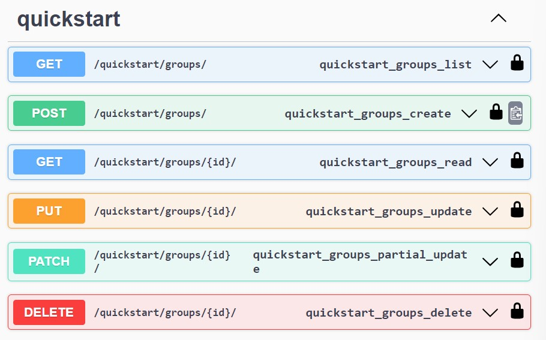
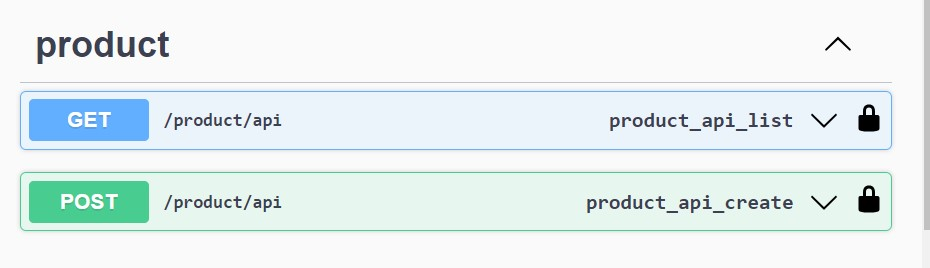

# Django RestFramework With OpenApi

## To create a project
`
django-admin startproject <projectname>
` 
E.g: 
`django-admin startproject coreApi`

## To create an app
syntax: 
`django-admin startapp <projectname> <appname>` 

E.g: 
`django-admin startapp coreApi product` 

or 
`django-admin startapp quickstart`

## To create initial user
syntax:  
`python manage.py createsuperuser --email <email_id> --username <user_name>` 

E.g: 
`python manage.py createsuperuser --email admin@example.com --username admin`

## To make migrations
`
python manage.py makemigrations
python manage.py migrate
`
## steps to be done after app is created
1. Add the app name in settings.py under "Installed_app"
2. Add models in models.py
3. Add Serializers 
4. Add views in views.py
5. add urlpatterns in urls.py
6. include the urls in <project> urls.py
7. Run migrations command
8. Run server to test your api

## viewSet
1. viewSet allows to automatically create API endpoints with models. Refer (quickstart/views.py)  
E.g: 

## view
1. as_view creates the api configuration and model based on the selected view. Refer (product/views.py)  
E.g 

